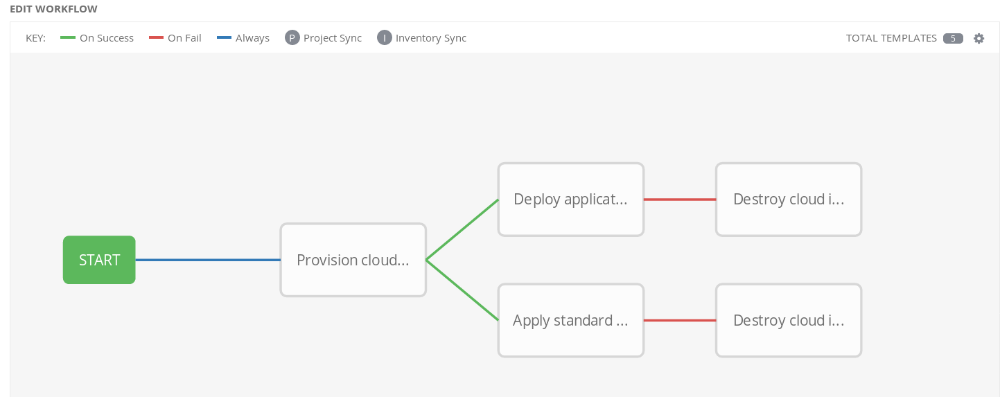

:noaudio:

ifdef::revealjs_slideshow[]
[#cover,data-background-image="image/1156524-bg_redhat.png" data-background-color="#cc0000"]
== &nbsp;

[#cover-h1]
Advanced Deployment with Red Hat Ansible Automation

[#cover-h2]
Extending Ansible Tower

[#cover-logo]
image::{revealjs_cover_image}[]

endif::[]
:scrollbar:
:data-uri:

== Introduction

* Ansible Tower Instance Groups
* Ansible Tower Isolated Nodes
* Workflows
* Job Slicing
* Automating Tower
* Ansible Tower API
* Automating Tower with Modules
* Automating Tower with `awx.awx` collection
* `awx` CLI
* Summary

ifdef::showscript[]

Transcript:

endif::showscript[]
:scrollbar:
:data-uri:

== Ansible Tower Instance Groups

.About Instance Groups

* Ansible Tower clusters allow you to add capacity to environment
** More nodes in cluster = more job execution capacity

* If running many jobs simultaneously, adding nodes to cluster enables running all jobs without queuing

** Provides additional "mass" capacity
** May be enough if just one group using Ansible Tower instance

* Instances shared among teams, groups, organizations with varying uses for automation

* _Instance group_ = set of cluster nodes dedicated for particular purpose

ifdef::showscript[]
Transcript:

endif::showscript[]
:scrollbar:
:data-uri:

== Ansible Tower Instance Groups

.About Instance Groups

* Ansible Tower cluster can be organized into any number of instance groups
* Cluster nodes can exist in multiple instance groups

* Each instance group has own job queue
** Any node in group can take jobs from queue

* Three ways to assign jobs to instance group:
** By organization
** By inventory
** By individual job template

ifdef::showscript[]
Transcript:

endif::showscript[]
:scrollbar:
:data-uri:

== Ansible Tower Instance Groups

.Configure Instance Groups

* Instance groups are set up in inventory file used by Ansible Tower setup playbook

* To define instance group named `Prod`:
** Create `[instance_group_Prod]` group in `inventory`
** Define Ansible Tower nodes to be in that group
+
[source,texinfo]
----
[tower]
tower1.dev.company
tower1.qa.internal
tower1.prod.internal

[instance_group_Prod]
tower1.prod.internal
tower2.prod.internal
----

ifdef::showscript[]
Transcript:

endif::showscript[]
:scrollbar:
:data-uri:

== Ansible Tower Instance Groups

.Configure Instance Groups

* Create as many instance groups as needed
* Put nodes in as many groups as needed
* Must have at least one node in base `[tower]` group

* Configure specific instance group under organization, inventory, job template that will use it

ifdef::showscript[]
Transcript:

endif::showscript[]
:scrollbar:
:data-uri:

== Ansible Tower Isolated Nodes

* *Isolated node*: Headless Ansible Tower node used for local execution capacity in either:
** Constrained networking environment, such as DMZ or VPC
** Remote data center for local execution capacity

* Ansible Tower cluster sends all jobs for relevant inventory to isolated node, runs them there
** When done, pulls job details back into Ansible Tower for viewing, reporting

* Prerequisite: SSH connectivity from Ansible Tower cluster to isolated node

* Periodically, master Ansible Tower cluster polls isolated node for job status
** Updates in as close to real time as possible

* When job finishes:
** Remote execution on isolated node cleaned up
** Job status updated in Ansible Tower

ifdef::showscript[]
Transcript:

endif::showscript[]
:scrollbar:
:data-uri:

== Ansible Tower Isolated Nodes

.Configure Isolated Nodes

* Set up in `inventory` file used by Ansible Tower setup program

* Isolated nodes make up own `instance_group`

* Example: To set up isolated nodes to access remote Red Hat OpenStack^(R)^ Platform environment:
+
[source,texinfo]
----
[isolated_group_osp]
solitude1.fortress
solitude2.fortress

[isolated_group_osp:vars]
controller=tower
----

ifdef::showscript[]
Transcript:

endif::showscript[]
:scrollbar:
:data-uri:

== Ansible Tower Isolated Nodes

.Configure Isolated Nodes

* Each isolated group must have `controller` variable in `[isolated_group_osp:vars]` section

* `controller` describes instance group that manages tasks sent to isolated node

** Responsible for starting, monitoring jobs on isolated node

* In previous example, main Ansible Tower cluster manages isolated group

* Like other instance groups, isolated node groups can be assigned at organization, inventory, individual job template level

ifdef::showscript[]
Transcript:

endif::showscript[]
:scrollbar:
:data-uri:

== Workflows

* Ansible Automation brought simple, agentless automation to IT
* Some IT processes do not lend themselves to being automated in single playbook
* Example: When provisioning environments that include:
** Basic provisioning -> default configuration -> application deployment
* Ansible Tower workflows help you chain any number of playbooks together

ifdef::showscript[]

Transcript:

endif::showscript[]
:scrollbar:
:data-uri:

== Workflows

* Each workflow step potentially using different playbook, inventory, set of
credentials
+

* Ansible Tower workflows help reuse tasks once provisioning is automated

* Easily launch one or more tasks after any step in workflow or run
cleanup playbook on failure if needed

ifdef::showscript[]

Transcript:

endif::showscript[]
:scrollbar:
:data-uri:

== Workflows

* Workflow convergence:
** Enables convergence step that tracks completion of multiple workflow jobs before continuing
** Example: When deploying application updates, may need to wait until group of nodes drains from load balancer pool before stopping service on any node in group
** Helps enable more complete dependency chain for jobs inside workflows

ifdef::showscript[]

Transcript:

endif::showscript[]
:scrollbar:
:data-uri:

== Workflows

* Nested workflows:
** Ability to have workflows within workflows
** Workflows with existing business logic and organizational requirements likely to become reusable modular components when:
*** Systems become large and complex
*** Systems are small but numerous and distributed

** Ability to nest workflows allows for even more complex operations
** Maintains same ease of use Ansible Automation is known for

ifdef::showscript[]

Transcript:

endif::showscript[]
:scrollbar:
:data-uri:

== Workflows

* Workflow-level inventory:
** Workflows in Ansible Tower historically depended on inventory from job templates
*** No longer the case
** Now able to specify inventory for workflow to be used by every job template in workflow
** Continuation of "Ansible way"

ifdef::showscript[]

Transcript:

endif::showscript[]
:scrollbar:
:data-uri:

== Job Slicing

* *Sliced job*: Refers to concept of distributed job
** Distributed jobs run single job across large numbers of hosts
** Allows running multiple Ansible Playbooks each on subset of inventory and scheduled in parallel across cluster

* Add `job_slice_count` field to job template

ifdef::showscript[]
Transcript:

endif::showscript[]
:scrollbar:
:data-uri:

== Job Slicing

.Job Slice Considerations

* Sliced job creates workflow job, which in turn creates jobs
* Job slice consists of job template, inventory, and slice count
* When executed, sliced job splits each inventory into multiple “slice size” chunks
* Sliced jobs follow normal scheduling behavior
* Sliced job templates with prompts and/or extra variables behave same as standard job templates, applying all variables
* Job slice job status of distributed job is calculated in same manner as workflow jobs

ifdef::showscript[]

Transcript:

A sliced job creates a workflow job, and then that creates jobs.
A job slice consists of a job template, an inventory, and a slice count.
When executed, a sliced job splits each inventory into a number of “slice size” chunks.
These sliced jobs follow normal scheduling behavior.
Sliced job templates with prompts and/or extra variables behave the same as standard job templates, applying all variables.
A job slice job status of a distributed job is calculated in the same manner as workflow jobs.

endif::showscript[]
:scrollbar:
:data-uri:

== Job Slicing

.Job Slice Execution Behavior
[.noredheader,cols="<,^",caption=""]
|======
a|* Job distribution slices job into separate executions on subset of Ansible inventory that can be scheduled in parallel
* Sliced jobs run on any Ansible Tower node and some may not run at same time
* Enables Ansible Tower users to parallelize jobs across nodes in Ansible Tower cluster with auto job slicing
|image:images/sliced-job-shown-jobs-output-view.png[width=100%]
|======

ifdef::showscript[]
Transcript:

When running a job across a large number of hosts, an appropriate fork count is issued, and cycling occurs until the job is done.
Job distribution slices a job into separate executions on a subset of Ansible inventory that can be scheduled in parallel.
When jobs are sliced, they are able to run on any Ansible Tower node and some may not run at the same time.
In a nutshell, Red Hat Ansible Tower users are now able to parallelize jobs across nodes in the Ansible Tower cluster with auto job slicing.
endif::showscript[]

:scrollbar:
:data-uri:

== Ansible Tower API

* Tower has a rich and fully featured API
** Allows fine grained control and configuration of Tower Resouces
*** Projects, users, inventories, job templates etc
** Allows job and workflow management
*** launch, cancel status etc
** Acts as an interface for external tooling, CI/CD, gitops etc

ifdef::showscript[]

endif::showscript[]
:scrollbar:
:data-uri:

== Browsable API

.Status and Monitoring via Browser API

[.noredheader,cols="<,^",caption=""]
|======
a|* `/api/v2/ping`
** Used by Ansible Tower for status reporting
** Browsable API
** Provides validation of cluster health
|image:images/tower-ping.png[width=100%]
|======

ifdef::showscript[]
Transcript:

* Ping status output includes:
** The node servicing the HTTP request
** The timestamps of the last heartbeats of all other nodes in the cluster
** The state of the job queue and any jobs each node is running
** The RabbitMQ cluster status

endif::showscript[]
:scrollbar:
:data-uri:

== Ansible Tower API

.Ansible Tower Modules

* Ansible Tower is supported by over 20 existing `tower_` modules
** `ansible-doc -l | grep tower_`
** Manages and creates tower resources
*** Projects, Users, Job Templates etc
** Built on top of the depreciated `tower-cli`

* Modules can be used to manage Ansible Tower
* Modules available to create credentials, users, projects, etc.

.Requirements

* Python >= 2.6
* `ansible-tower-cli` 
* <optional> `tower_cli.cfg` configuration file with Ansible Tower host, user credentials

ifdef::showscript[]
Transcript:

endif::showscript[]
:scrollbar:
:data-uri:

== Ansible Tower Modules

.Ansible Tower Modules: Examples

* `tower_project`: Create, update, or destroy Ansible Tower projects
+
[source,texinfo]
----
- name: Add tower project
  tower_project:
    name: "3 tier APP"
    description: "Three Tier Application"
    organization: "default"
    state: present
    tower_config_file: "~/tower_cli.cfg"
----
* `tower_inventory`: Create, update, or destroy Ansible inventory
+
[source,texinfo]
----
- name: Add tower inventory
  tower_inventory:
    name: "Foo Inventory"
    description: "Our Foo Cloud Servers"
    organization: "Bar Org"
    state: present
    tower_config_file: "~/tower_cli.cfg"
----

ifdef::showscript[]
Transcript:

endif::showscript[]
:scrollbar:
:data-uri:

== Ansible Tower Modules

.Ansible Tower Modules: Examples

* `ansible_job_list`: List Ansible Tower jobs
+
[source,texinfo]
----
- name: List running jobs for the testing.yml playbook
  tower_job_list:
    status: running
    query: {"playbook": "testing.yml"}
    register: testing_jobs
    tower_config_file: "~/tower_cli.cfg"
----

* `ansible_job_cancel`: Cancel Ansible Tower job
+
[source,texinfo]
----
- name: Cancel job
  tower_job_cancel:
    job_id: job.id
----

ifdef::showscript[]
Transcript:

endif::showscript[]
:scrollbar:
:data-uri:

== Automating Tower with Collections

* Ansible `2.9` introduces support for Collections
* link:https://galaxy.ansible.com/awx/awx[`awx.awx`] collection includes > 32 new *modules* 
** More fully featured that the previous modules mentioned above
* Ansible Tower `3.6` introduces `awx` cli replacement for `tower-cli`

NOTE: Some customers will block content for *Ansible Galaxy* as being "beyond the Firewall*

ifdef::showscript[]
Transcript:

endif::showscript[]
:scrollbar:
:data-uri:

== New awx.awx modules

.Installation

* Use Ansible Galaxy (or Automation Hub)
** `ansible-galaxy collection install awx.awx`
** optinal specfify directory e.g.:
*** `ansible-galaxy collection install awx.awx -p collections`

.Module location
* `ls collections/ansible_collections/awx/awx/plugins/modules`
* ansible-doc supports FQCNs (Fully Qualified Collection Name)
* Show existing 2.9 module: `ansible-doc tower_project`
* Show `awx.awx` module: `ansible-doc awx.awx.tower_project`

ifdef::showscript[]
Transcript:

endif::showscript[]

:scrollbar:
:data-uri:

== Using Collection Modules

. Via  FQCNs (Fully Qualified Collection Name)
+
[source,yaml]
----
- name: Create GPTE organization
  awx.awx.tower_organization:
      name: GPTE
      description: GPTE Organization
      state: present
----

. Via `collections` keyword
+
[source,yaml]
----
  collections:
    - awx.awx

  tasks:

    - name: Create GPTE organization
      tower_organization:
          name: GPTE
          description: GPTE Organization
          state: present
----

ifdef::showscript[]
Transcript:

endif::showscript[]

== `awx` CLI tool

* Replaces the older, depreciated, `tower-cli` 
* More powerful feature set
** Multiple output formats:
** human, yaml, json, jq

[source,bash]
----
awx [<global-options>] <resource> <action> [<arguments>]
awx project list
awx --help
----
ifdef::showscript[]
Transcript:

endif::showscript[]
:scrollbar:
:data-uri:

== `awx`

.Installation
* via `yum`
+
[source,bash]
----
yum-config-manager \
    --add-repo https://releases.ansible.com/ansible-tower/cli/ansible-tower-cli-el7.repo
yum install ansible-tower-cli
----

* via `pip3`
+
[source,bash]
----
pip3 install --user https://releases.ansible.com/ansible-tower/cli/ansible-tower-cli-latest.tar.gz
----

.Documnetation

* link:https://docs.ansible.com/ansible-tower/latest/html/towercli/index.html[Latest AWX Docs]

ifdef::showscript[]
Transcript:

endif::showscript[]
:scrollbar:
:data-uri:
:noaudio:

== `awx` Authentication

* Multiple ways to authenticate 
** link:https://docs.ansible.com/ansible-tower/latest/html/towercli/authentication.html[Authentication Documentation]
* Cli
+
[source,bash]
----
awx --conf.host https://awx.example.org \
    --conf.username joe --conf.password secret \
    --conf.insecure \
    users list
----
* Via ENV Vars

+
[source,bash]
----
export TOWER_HOST=https://tower.<GUID>.example.opentlc.com
export TOWER_USERNAME=admin
export TOWER_PASSWORD=r3dh4t1!
export TOWER_VERIFY_SSL=false
awx user list
----
* Via tower_cli file

ifdef::showscript[]
Transcript:

You generally need to set at least three configuration options-–host,
username, and password–-that correspond to the location of your Ansible Tower
instance and your credentials to authenticate to Ansible Tower.

$ awx config host tower.example.com

$ awx config username royjenkins

$ awx config password myPassw0rd

Write to the config files directly.
The configuration file can also be edited directly. A configuration file is a
simple file with keys and values, separated by : or =:

host: tower.example.com

username: admin

password: p4ssw0rd

endif::showscript[]
:scrollbar:
:data-uri:

== Using `awx` CLI

* Simple ping `awx ping`
* Syntax: `awx <object> <action> <additional flags>`
** Note very *rich* output support

Examples: 

* List jobs: `awx job list` defaults to JSON
** `awx job list -f human`
** filter output `awx jobs list --all -f human --filter 'id,name,status'`
* Retrieve a job output: `awx job stdout 6` where `6` `job_id>`
* Retrieve job by name: 
+
[source,bash]
----
awx jobs list \ 
  --name destroy-agnosticd-three-tier-app-prod-1.14-3tier-test-01 \
  -f human --filter 'id, name,status'`
----

* Launch job `foo`: `awx job_template launch foo -f human`

ifdef::showscript[]

Transcript:

endif::showscript[]

== Summary

* Ansible Tower Instance Groups
* Ansible Tower Isolated Nodes
* Workflows
* Job Slicing
* Automating Tower
* Ansible Tower API
* Automating Tower with Modules
* Automating Tower with `awx.awx` collection
* `awx` CLI

ifdef::showscript[]

Transcript:

endif::showscript[]
:scrollbar:
:data-uri:
